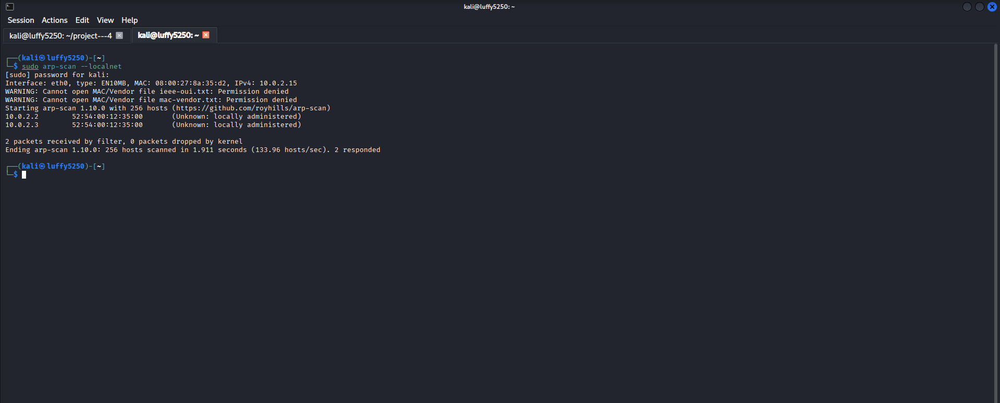
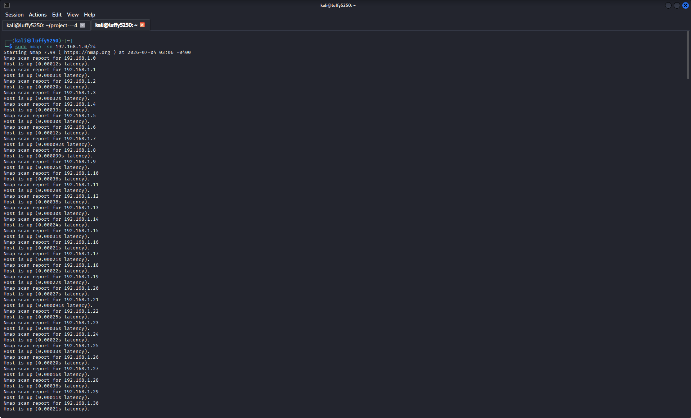
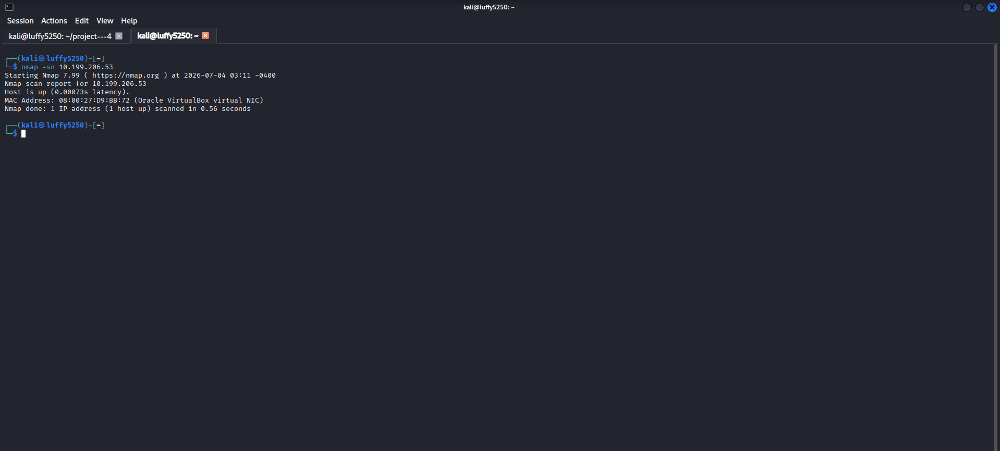
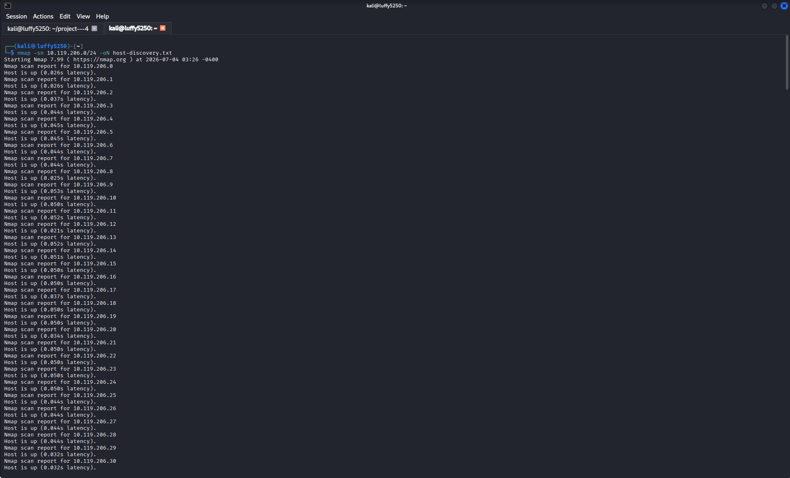
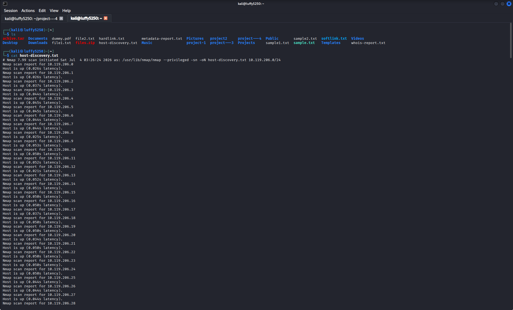

# Part 1 – Finding Hosts on a Network

## What We Want to Do

We need to find out which hosts are active on a network. We will use Nmap and ARP scanning to do this before we do a scan of the network.

---CC

# What is Finding Hosts?

Finding hosts is the step in scanning a network. It helps us figure out which systems are online. Then we can scan those hosts.

---

## 1. Find Live Hosts Using ARP Scan

### What We Are Doing

We want to find all the devices that are connected to our network.

### What to Type

```bash

sudo arp-scan --localnet

```

### How It Works

This uses ARP requests to find devices on our LAN.

> If you need to install it:

```bash

sudo apt install -scan

```

### Picture



---

## 2. Find Live Hosts Using Nmap

### What We Are Doing

We want to find hosts on our subnet without checking their ports.

### What to Type

```bash

sudo nmap -sn 192.168.1.0/24

```

### How It Works

This does a host discovery only it does not scan ports.

Replace the subnet with your network.

### Picture



---

## 3. Scan One Host

### What We Are Doing

We want to check if a specific host's online.

### What to Type

```bash

nmap -sn 192.168.1.10

```

### How It Works

This checks if one target system is reachable.

Replace the IP address with a host on your network.

### Picture



---

## 4. Save the Scan Results

### What We Are Doing

We want to save the host discovery results so we can look at them later.

### What to Type

```bash

nmap -sn 192.168.1.0/24 -oN host-discovery.txt

```

### How It Works

This saves the output in a normal text file.

### Picture



---

## 5. Look at the Saved Report

### What We Are Doing

We want to open the saved scan report.

### What to Type

```bash

cat host-discovery.txt

```

### How It Works

This shows us what is in the saved Nmap report.

### Picture



---C

# Things We Learned

- Finding hosts, on a network

- ARP scanning

- Using Nmap to find hosts

- Finding live hosts

- Saving Nmap output

---

# conclusion

In this part I learned how to:

- Find hosts using ARP.

- Use Nmap to find hosts.

- Scan one host.

- Save scan results.

- Look at reports.
