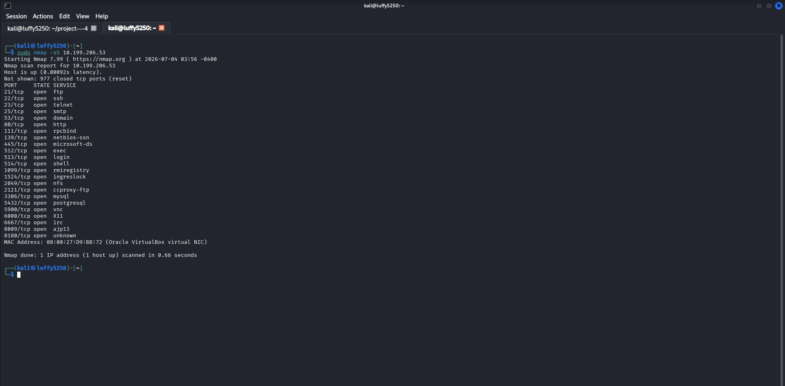
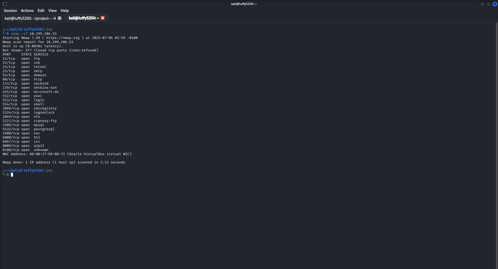
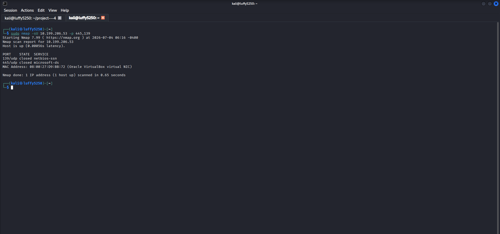
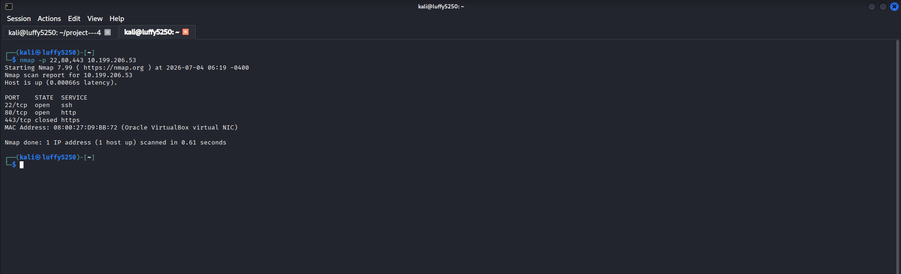
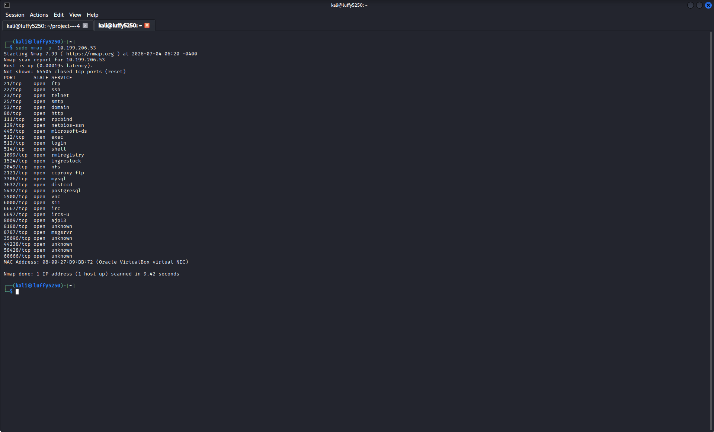
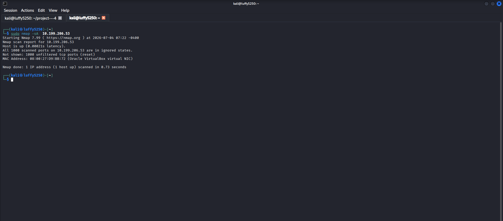
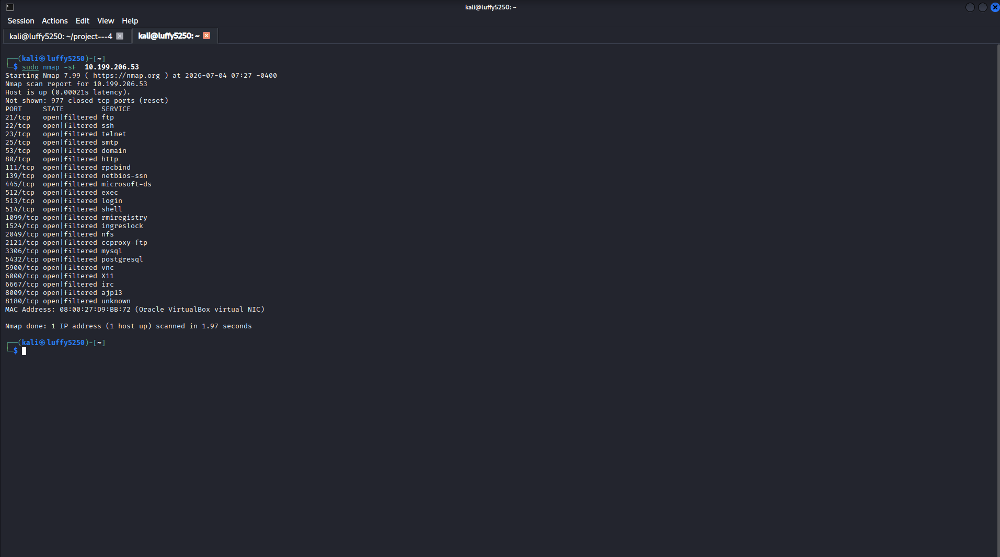
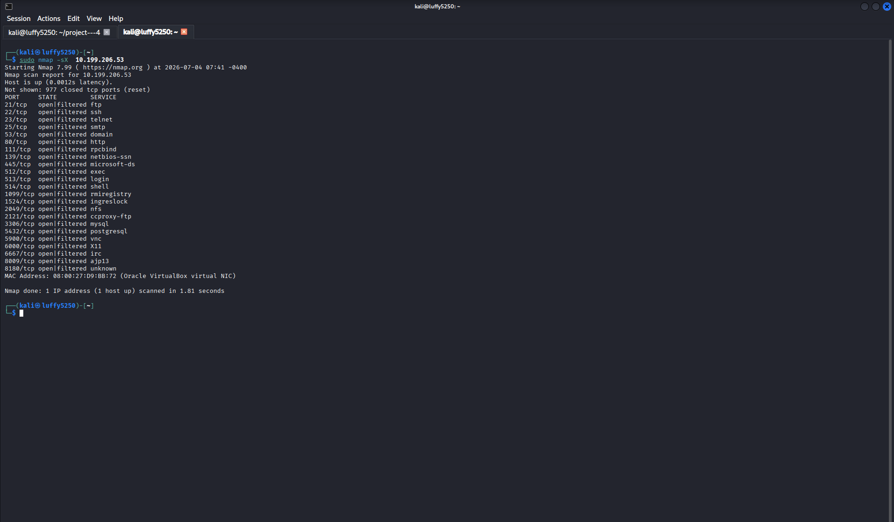

# Part 1 – Finding Hosts on a Network

## What We Want to Do

We need to find out which hosts are active on a network. We will use Nmap and ARP scanning to do this before we do a scan of the network.

---

# What is Finding Hosts?

Finding hosts is the step in scanning a network. It helps us figure out which systems are online. Then we can scan those hosts.

---

## 1. Find Live Hosts Using ARP Scan

### What We Are Doing

We want to find all the devices that are connected to our network.

### What to Type

```bash

sudo arp-scan --localnet

```

### How It Works

This uses ARP requests to find devices on our LAN.

> If you need to install it:

```bash

sudo apt install -scan

```

### Picture


---

## 2. Find Live Hosts Using Nmap

### What We Are Doing

We want to find hosts on our subnet without checking their ports.

### What to Type

```bash

sudo nmap -sn 192.168.1.0/24

```

### How It Works

This does a host discovery only it does not scan ports.

Replace the subnet with your network.

### Picture


---

## 3. Scan One Host

### What We Are Doing

We want to check if a specific host's online.

### What to Type

```bash

nmap -sn 192.168.1.10

```

### How It Works

This checks if one target system is reachable.

Replace the IP address with a host on your network.

### Picture


---

## 4. Save the Scan Results

### What We Are Doing

We want to save the host discovery results so we can look at them later.

### What to Type

```bash

nmap -sn 192.168.1.0/24 -oN host-discovery.txt

```

### How It Works

This saves the output in a normal text file.

### Picture


---

## 5. Look at the Saved Report

### What We Are Doing

We want to open the saved scan report.

### What to Type

```bash

cat host-discovery.txt

```

### How It Works

This shows us what is in the saved Nmap report.

### Picture


---

# Things We Learned

- Finding hosts, on a network

- ARP scanning

- Using Nmap to find hosts

- Finding live hosts

- Saving Nmap output

---

# conclusion

In this part I learned how to:

- Find hosts using ARP.

- Use Nmap to find hosts.

- Scan one host.

- Save scan results.

- Look at reports.


---------------------------------------------------------------------------------------------------------------------------------------------------------------------------------------------------------------

# Part 2 – Port Scanning

## Objective

I want to learn how to find open closed and filtered ports using Nmap scan methods.

## What is Port Scanning?

Port scanning is checking which network ports on a target system are open and what services are available through them.

When I see ports it means there are services running that might need more assessment.

## 1. TCP SYN Scan

### Scenario

I will do a stealth TCP SYN scan.

### Command

```bash

sudo nmap -sS 192.168.1.10

```

### Description

This scan does a SYN scan without finishing the TCP handshake.

It is a way to see which ports are open.

### Screenshot



## 2. TCP Connect Scan

### Scenario

I need to do a full TCP connection scan.

### Command

```bash

nmap -sT 192.168.1.10

```

### Description

This scan uses the operating systems TCP stack to make a connection.

It is slower than a SYN scan. Gets more information.

### Screenshot



## 3. UDP Scan

### Scenario

I want to find UDP ports.

### Command

```bash

sudo nmap -sU 192.168.1.10

```

### Description

This scan looks for UDP services running on the target.

UDP scans are slower and less reliable than scans.

### Screenshot



## 4. Scan Specific Ports

### Scenario

I will scan some ports.

### Command

```bash

nmap -p 22,80,443 192.168.1.10

```

### Description

This scan only looks at the ports I specify.

It is useful when I only care about services.

### Screenshot



## 5. Scan All TCP Ports

### Scenario

I need to scan all ports.

### Command

```bash

sudo nmap -p- 192.168.1.10

```

### Description

This scan looks at 65,535 TCP ports.

It takes a time and might be noisy.

### Screenshot



## Key Concepts Learned

- TCP SYN Scan

- TCP Connect Scan

- UDP Scan

- Port Selection

- Full Port Scanning


# Conclusion

In this part, I learned:

- Different types of Nmap port scans.
- The difference between TCP and UDP scanning.
- How to scan selected ports.
- How to scan all TCP ports.


---------------------------------------------------------------------------------------------------------------------------------------------------------------------------------------------------------------

# Part 3 – Service & Version Detection

## Objective

I want to learn how to find out what services are running on ports and what versions they are. This is really important for checking if something is vulnerable and for the rest of the hacking process.

---

# What is Service & Version Detection?

So after I find out which ports are open the next thing I need to do is figure out what service is running on each port and what version it is.

Knowing the version of a service helps people who work in security:

- Find out if the software is old.

- Look for known problems with the service.

- Check if the service is set up correctly.

---

## 1. Detect Service Versions

### Scenario

I need to identify the services and their versions that are running on my target.

### Command

```bash

sudo nmap -sV 192.168.1.10

```

### Description

This command checks the versions of services that are running on ports.

### Screenshot


---

## 2. Detect Services with Default Scripts

### Scenario

I want to get information about the services using the default scripts that come with Nmap.

### Command

```bash

sudo nmap -sV -sC 192.168.1.10

```

### Description

This command checks the versions of services. Also uses the default Nmap scripts to get more information.

### Screenshot


---

## 3. Increase Version Detection Intensity

### Scenario

I want to do a detailed check of the service versions.

### Command

```bash

sudo nmap -sV --version-intensity 9 192.168.1.10

```

### Description

This command makes the version check more intense so it can find the versions accurately.

### Screenshot


---

## 4. Detect Versions on Specific Ports

### Scenario

I only want to check the versions of services.

### Command

```bash

sudo nmap -sV -p 22,80,443 192.168.1.10

```

### Description

This command only checks the versions of the services that are running on the ports I specify.

### Screenshot


---

# Information Collected

When I do service detection I can find out:

- What the service is called

- What version it is

- What product it is

- What protocol it uses

- If the port is open or not

---

# Key Concepts Learned

- Service detection is when I find out what services are running.

- Version detection is when I find out what version a service is.

- Nmap can scan for versions.

- The default NSE scripts can help me find out more, about the services.

- I can make the version detection more intense.

---

# Conclusion

In this part, I learned:

- How to identify services running on open ports.
- How to determine software versions.
- How default NSE scripts improve service identification.
- Why version detection is important before vulnerability analysis.


-------------------------------------------------------------------------------------------------------------------------------------------------------------------------------------------------------------------


# Part 4 – Operating System Detection & Network Path Analysis

## Objective

My goal is to learn how to figure out what operating system the target is using and understand the path that the network takes to get to the target.

---

# Why OS Detection?

After I find out which hosts are live which ports are open and what services are running the next step is to determine some things about the target:

- What Operating System is the target using

- How far away is the target on the network

- What is the route to the target

This information helps people who work in security understand the target environment before they do any more testing.

---

## 1. Operating System Detection

### Scenario

I need to identify the operating system that is running on the target.

### Command

```bash

sudo nmap -O 192.168.1.10

```

### Description

This command tries to identify the operating system by looking at how the target responds to TCP/IP requests.

### Screenshot


---

## 2. Os Detection

### Scenario

I want to improve the accuracy of the operating system detection.

### Command

```bash

sudo nmap -O --osscan-guess 192.168.1.10

```

### Description

This command tries to guess what operating system is being used when it cannot find a match.

### Screenshot


---

## 3. Perform Traceroute

### Scenario

I need to find out what path the packets take to get to the target.

### Command

```bash

sudo nmap --traceroute 192.168.1.10

```

### Description

This command shows me the route that the network takes to get from my system to the target.

### Screenshot


---

## 4. Determine Network Distance

### Scenario

I want to estimate how many hops it takes to get from my scanner to the target.

### Command

```bash

sudo nmap --reason 192.168.1.10

```

### Description

This command tells me why Nmap thinks the host is in a state and often gives me some useful information, about what it found.

### Screenshot


---

# Key Concepts Learned

- Operating System Detection

- TCP/IP Fingerprinting

- Traceroute

- Network Path Analysis

- Host Detection Reasoning

---

# Conclusion

In this part, I learned:

- How Nmap detects operating systems.
- How OS fingerprinting works.
- How to identify the network path.
- How to interpret Nmap's detection results.


---------------------------------------------------------------------------------------------------------------------------------------------------------------------------------------------------------------


# Part 5 – Firewall Detection & Advanced Scan Techniques

## Objective

I want to learn how different Nmap scan techniques help analyze hosts with filters and understand how firewalls behave during network scanning.

---

# What is Firewall Detection?

Firewalls are like traffic cops. They. Block network traffic based on set rules.

When scanning a firewall may make ports seem:

- Open

- Closed

- Filtered

Understanding these responses helps security pros interpret scan results correctly. We need to know what we're looking at.

---

## 1. ACK Scan

### Scenario

I need to find out if a firewall is filtering packets.

### Command

```bash

sudo nmap -sA 192.168.1.10

```

### Description

An ACK scan helps tell if ports are filtered or not. It's like sending a ping and seeing how the firewall responds.

### Screenshot



---

## 2. FIN Scan

### Scenario

I will perform a FIN scan on the target.

### Command

```bash

sudo nmap -sF 192.168.1.10

```

### Description

FIN packets help identify port states on some operating systems. It's another tool to figure out whats going on.

### Screenshot



---

## 3. NULL Scan

### Scenario

I will send packets with no flags set.

### Command

```bash

sudo nmap -sN 192.168.1.10

```

### Description

NULL packets help identify filtered or open ports on some systems. It's, like a probe.

### Screenshot


---

## 4. Xmas Scan

### Scenario

I will send packets with FIN PSH and URG flags enabled.

### Command

```bash

sudo nmap -sX 192.168.1.10

```

### Description

An Xmas scan analyzes firewall and TCP stack responses. It's a way to see how the target reacts.

### Screenshot



---

# Key Concepts Learned

- ACK Scan

- FIN Scan

- NULL Scan

- Xmas Scan

- Filtered Ports

- Firewall Behavior

---

# Conclusion

In this part, I learned:

- How different scan types interact with firewalls.
- How filtered ports differ from closed ports.
- How ACK, FIN, NULL, and Xmas scans support network reconnaissance.
- Why scan results vary depending on the target operating system and firewall configuration.
